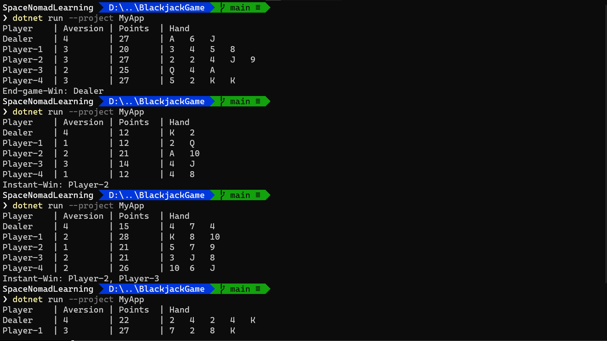
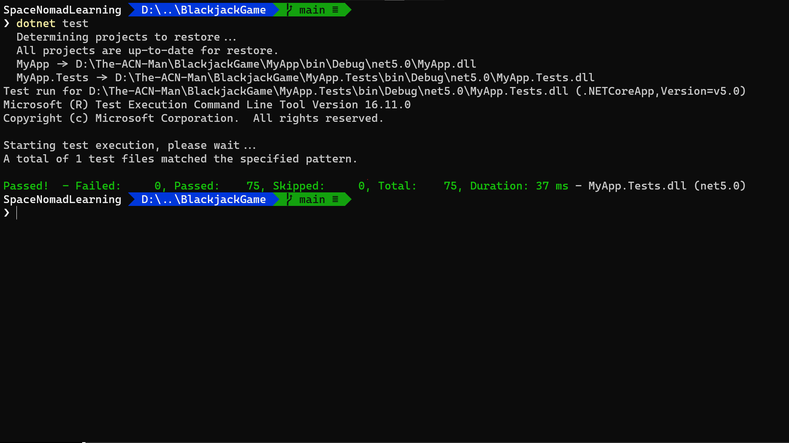
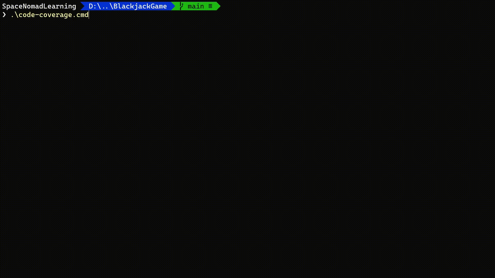
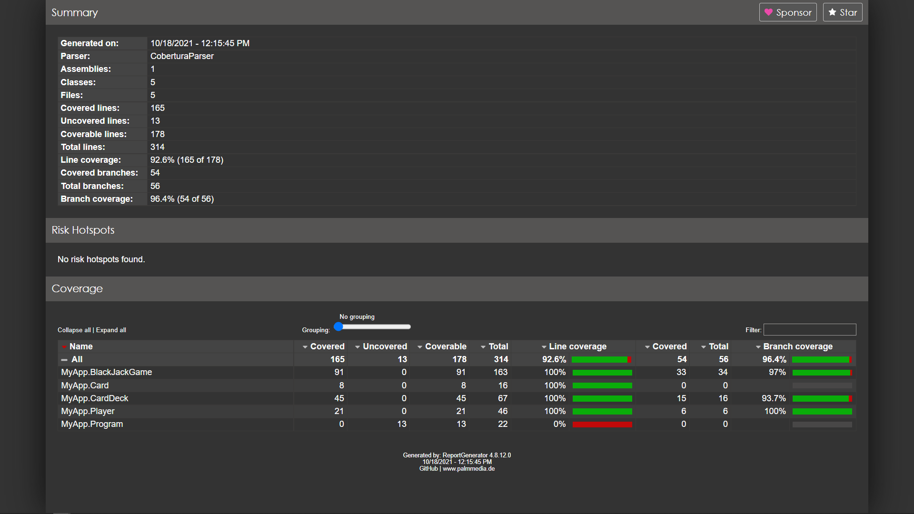

# Blackjack game

Check [docs](./docs/Simplified-Blackjack.md) for info about app requirements.

[](https://dev.azure.com/SpaceNomadLearning/BlackJackGame/_build/latest?definitionId=4&branchName=main)

**Table of Contents:**
- [Blackjack game](#blackjack-game)
  - [Prerequisites](#prerequisites)
  - [Run solution](#run-solution)
  - [Test solution](#test-solution)
  - [Code Coverage](#code-coverage)

## Prerequisites

* Install [NET Core 5.0 SDK](https://dotnet.microsoft.com/download/dotnet/5.0)
* To ensure the *dotnet* is setup, run next command:

```cmd
dotnet --version
```

## Run solution

* On the `root folder` run next command:

```cmd
dotnet run --project MyApp
```

With each project run, the output displays each player's and the dealer's final
hand into a file and specifies who won.



* Execution 1:

```txt
Player    | Aversion | Points  | Hand
Dealer    | 4        | 22      | K   5   7
Player-1  | 0        | 24      | 4   10  Q
Player-2  | 1        | 26      | 4   2   3   8   9
Player-3  | 0        | 25      | A   3   A
Player-4  | 2        | 28      | 8   Q   J
End-game-Win: Dealer
```

* Execution 2:

```txt
Player    | Aversion | Points  | Hand
Dealer    | 4        | 20      | 10  3   7
Player-1  | 3        | 25      | 3   J   2   J
Player-2  | 2        | 20      | 10  K
Player-3  | 3        | 27      | 5   3   9   Q
Player-4  | 0        | 26      | 9   A   6
End-game-Win: Player-2
```
* Execution 3:

```txt
Player    | Aversion | Points  | Hand
Dealer    | 4        | 21      | A   10
Player-1  | 0        | 15      | 7   8
Player-2  | 2        | 13      | 8   5
Player-3  | 0        | 9       | 3   6
Player-4  | 2        | 21      | A   J
Instant-Win: Dealer, Player-4
```
* Execution 4:

```txt
Player    | Aversion | Points  | Hand
Dealer    | 4        | 18      | 8   K
Player-1  | 0        | 17      | 2   J   5
Player-2  | 3        | 18      | 2   6   Q
Player-3  | 0        | 21      | Q   2   9
Player-4  | 0        | 29      | 8   A   10
Instant-Win: Player-3
```
* Execution 5:

```txt
Player    | Aversion | Points  | Hand
Dealer    | 4        | 22      | 2   10  K
Player-1  | 3        | 20      | Q   Q
Player-2  | 2        | 28      | 10  8   J
Player-3  | 1        | 24      | 5   2   7   K
Player-4  | 1        | 24      | 5   A   8
End-game-Win: Dealer
```

## Test solution

* On the `root folder` run next command:

```cmd
dotnet test
```



## Code Coverage

* On the `root folder` execute script:

```cmd
code-coverage.{cmd|sh}
```



* Open **coverage-report/index.html** file in you're preferred browser --or--
  [Check CI coverage reports on Azure][CI-coverage]



<!-- Links: -->
[CI-coverage]: https://dev.azure.com/SpaceNomadLearning/BlackJackGame/_build/results?buildId=273&view=codecoverage-tab
