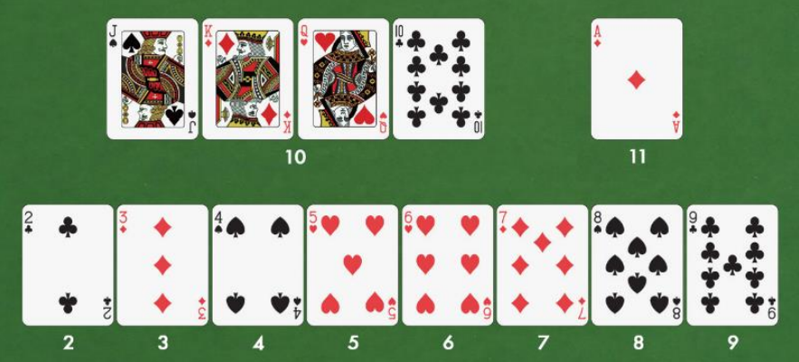

# Simplified blackjack

**Table of Contents**:
- [Simplified blackjack](#simplified-blackjack)
  - [The game](#the-game)
    - [Basic rules](#basic-rules)
    - [Card values](#card-values)
    - [Playing the game](#playing-the-game)
    - [Instant-Win conditions](#instant-win-conditions)
    - [The game ends](#the-game-ends)
      - [End-game winner (non-instant-win)](#end-game-winner-non-instant-win)
    - [The dealer](#the-dealer)
    - [Program requirements](#program-requirements)

## The game

Simulate a simplified game of blackjack using the C# programming language.

### Basic rules

- There are 52 cards in the deck (4 suits with 13 cards each)
- The game has four players and a dealer.
- The value of the hand is given by the sum of the value of the cards

### Card values

### Playing the game

- Initial phase
    - The deck gets shuffled
    - Each player gets two cards
- After the initial phase, the players take turns by receiving a card
- Each player
    - loses and stops if his/her hand goes over 21
    - has a certain risk aversion (0...4); a player will stop drawing cards if
      he/she reaches the 21-riskAversion value for his/her hand.

### Instant-Win conditions

- “blackjack” hand - A player’s first two cards are an ACE and a card with a 10
  value.
- A player reaches exactly 21

### The game ends 

- When a player instant-wins
- when all the players stop or lose by going over 21

#### End-game winner (non-instant-win) 

- The players/dealer that haven’t lost and are the closest to 21

### The dealer

- Acts exactly like any other player with the following exceptions
    - Has a fixed risk aversion of 4 (will always stop at 17)
    - Doesn’t lose if he/she goes over 21: in the end-game winner scenario, a
      dealer with a hand of 22 will win against a player with a hand of 18.

### Program requirements

- The program is a simulation: it takes no user input and outputs the result
  into a file
- Write each player’sand the dealer’s final hand into a file and specifies who
  won
